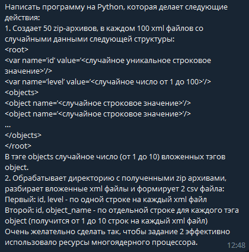

# Тестовое задание
## Задача


## Реализованные механизмы
- Генерация xml-документов по заданному параметру
- Сохранение заданного количества xml-документов в zip архив
- Чтения xml - документов из заданного каталога, запись данных в csv

## Описание реализации
- Генерация документов, запись и чтение реализовано через многопроцессорную обработку с использованием библиотеки multiprocessing
- Для генерации или получения структуру xml документов с заданными параметрами реализован класс TestXml.
- Для обработки документов реализован интерфейс через класс TestXmlManager.
- Чтение документов не очень оптимально расходует память, поскольку сохраняет сущности xml-документов (экземпляры класса TestXml) в хранилище. Такая реализация преследует цель возможной обработки документов в будущем. Для оптимизации данного процесса можно было реализовать генератор, который записывает нужные данные в csv без хранения сущностей.
- Реализовано несколько вариантов запуска программы путем передачи требуемых аргументов, по умолчанию запуск происходит на заданных условиях.

## Запуск программы
Установить питон нужной версии
```shell
pyenv install 3.10.8
```

Установить зависимости. По умолчанию используются все стандартные библиотеки Python, поэтому создание виртуального окружения опционально, требуется установить лишь библиотеки для типизации данных.
```shell
pip install -r requirements.txt
```

Запуск скрипта
```shell
python main.py --action {all,save,upload} --zip_dir <путь к каталогу хранения zip архивов> --csv_dir <путь к каталогу с csv> --zip_count <количество архивов> --xml_in_zip <количество xml-документов в архиве> --processes <количество процессов, которое хотим задать для выполнения>
```

По умолчанию скрипт можно запустить данной командой, файлы сохранятся в каталоге /files в каталоге программы, будет выполняться в 4 процессах
```shell
python main.py
```